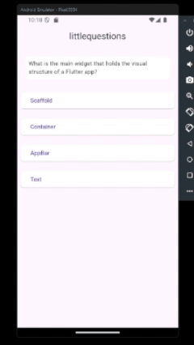

<h1 align="center" style="font-weight: bold;">Little Questions 💻</h1>

<p align="center">
 <a href="#tech">Technologies</a> • 
 <a href="#started">Getting Started</a> • 
  <a href="#author">Author</a> •
 <a href="#contribute">Contribute</a>
</p>

<p align="center">
    <b>The little questions app was developed to put into practice the basics of Flutter that I learned during the course (Learn Flutter and Develop Apps for Android and IOS from COD3R on udemy).</b>
</p>

<p align="center">
     <a href="">📱 Visit this Project</a>
</p>

<h2 id="layout">🎨 Layout</h2>

<p align="center">
    
</p>

<h2 id="technologies">💻 Technologies</h2>

- Flutter 3.24

<h2 id="started">🚀 Getting started</h2>

Read, please: [documentation](https://flutter.dev/).

<h3>Prerequisites</h3>

Here you list all prerequisites necessary for running your project. For example:
- [VsCode](https://code.visualstudio.com/)
- [Flutter](https://flutter.dev/)
- [JavaSDK](https://www.oracle.com/br/java/technologies/downloads/)
- [Android Studio](https://developer.android.com/studio?hl=pt-br)

<h3>Cloning</h3>

How to clone your project

```bash
git clone littlequestions
```

<h3>Starting</h3>

How to start your project

```bash
cd littlequestions
flutter run
```

<h2 id="author">🤝 Author</h2>

[Call me](https://bento.me/suamirochadev)

<table>
  <tr>
    <td align="center">
      <a href="https://bento.me/suamirochadev">
        <br>
        <sub>
          <b>Suami Rocha</b>
        </sub>
      </a>
    </td>
  </tr>
</table>

<h2 id="contribute">📫 Contribute</h2>

Here you will explain how other developers can contribute to your project. For example, explaining how can create their branches, which patterns to follow and how to open an pull request

1. `git clone https://github.com/littlequestions/`
2. `git checkout -b feature/NAME`
3. Follow commit patterns
4. Open a Pull Request explaining the problem solved or feature made, if exists, append screenshot of visual modifications and wait for the review!
# little-questions
